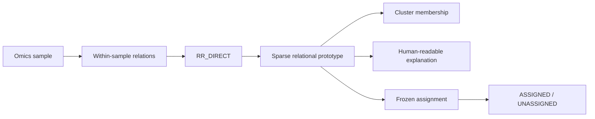
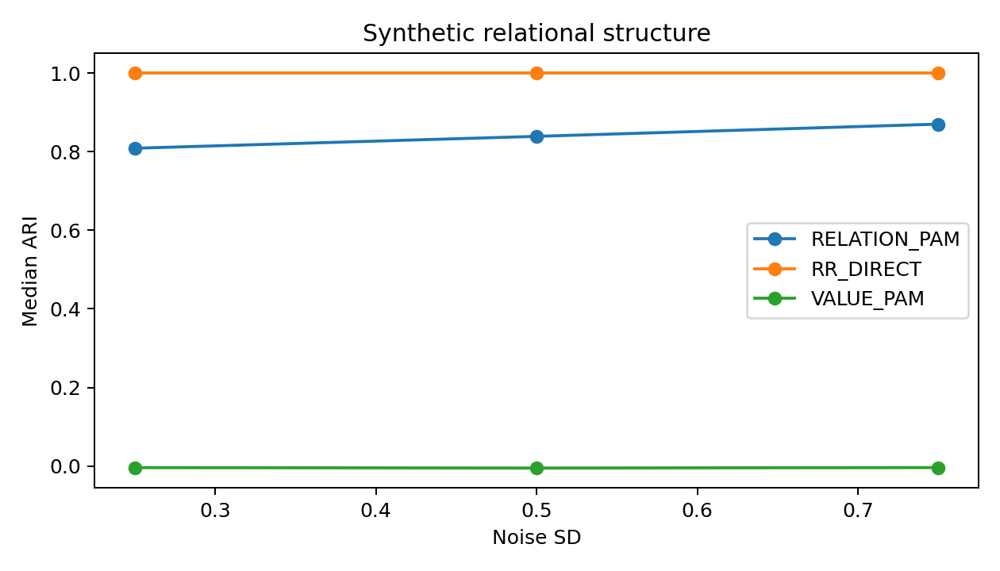
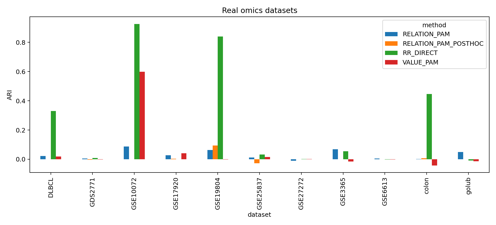
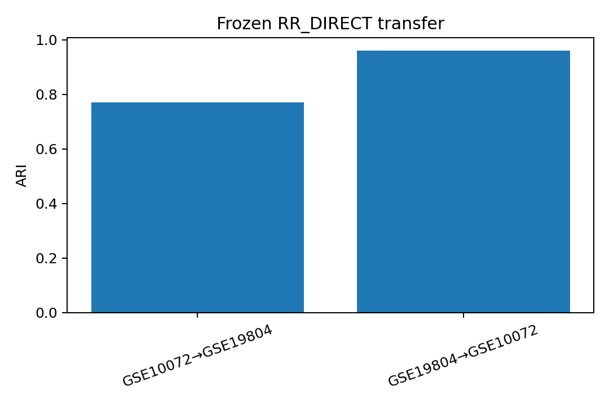
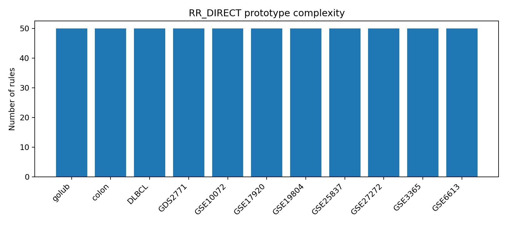
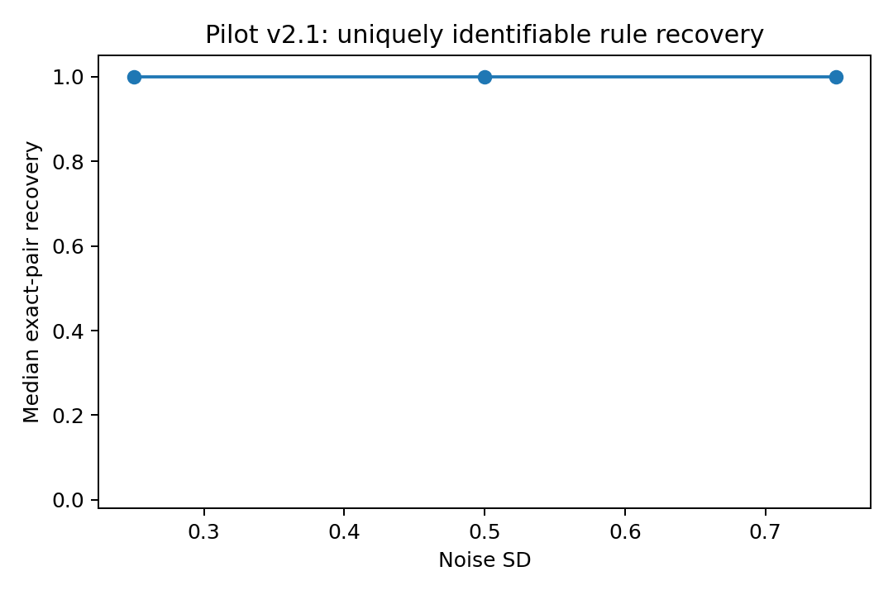

> **Historical pilot archive.**
> This repository preserves the frozen Representation Audit and RR_DIRECT pilot evidence, including the original GO/STOP decisions.
> The current SONATA BIS research programme and clean RPP/RTC implementation are maintained at:
> https://github.com/mczajkowskipb/transferable-relational-patient-profiles

# Omics Representation Audit Pilot

**Interpretable omics clustering through sparse executable within-sample relational prototypes.**


This repository contains the reproducible computational pilot behind the programme
**Sparse Relational Prototypes for Interpretable and Transportable Omics Clustering**.

> **Can clusters be learned directly as sparse within-sample relational prototypes that simultaneously define a group, explain membership, and assign unseen objects?**

A prototype is an executable set such as `{gene_A > gene_B, gene_C < gene_D, ...}`.
The same object defines a cluster, explains membership and can be frozen for target-independent
single-sample assignment. The future framework adds `UNASSIGNED` and `NO_STABLE_STRUCTURE`.

[**Pilot evidence**](docs/pilot_v2/PILOT_EVIDENCE.md) ·
[**Pilot v2 protocol**](docs/pilot_v2/PROTOCOL.md) ·
[**RR_DIRECT implementation**](src/rep_audit/prototypes/rr_direct.py) ·
[**Prospective external-cohort freeze**](docs/grant/SONATA_BIS16_EXTERNAL_VALIDATION_FREEZE_v2.md)

---

## Results at a glance

| Evidence | Result |
|---|---:|
| Synthetic relational structure — RR_DIRECT median ARI | **1.000** |
| Best frozen cross-cohort transfer ARI | **0.960** |
| Coverage at best transfer | **92.5%** |
| RR_DIRECT median ARI across 11 real omics datasets | **0.033** |
| RELATION/PAM median ARI across 11 real omics datasets | **0.022** |
| Pilot v2.1 exact-pair recovery | **1.000** |
| Reproducibility validation | **155 tests passed** |

> **Scientific status:** Pilot v2 remains **STOP** (4/5 prospective criteria passed).
> Pilot v2.1 diagnosed non-identifiability of the failed exact-pair endpoint and is
> **not** a retrospective gate rescue.

## Core idea



## Results gallery

### Synthetic relational structure


### Eleven real omics datasets


### Frozen cross-cohort transfer


### Prototype complexity


### Identifiability diagnostic


## Selected real-data observations

| Dataset | RR_DIRECT | RELATION/PAM | VALUE/PAM |
|---|---:|---:|---:|
| GSE10072 | **0.926** | 0.087 | 0.598 |
| GSE19804 | **0.839** | 0.063 | -0.001 |
| Colon | **0.446** | 0.002 | -0.042 |
| DLBCL | **0.329** | 0.022 | 0.018 |

These are **descriptive pilot observations**, not a claim of broad superiority.

## Frozen pilot transfer

| Source → Target | ARI | Coverage |
|---|---:|---:|
| GSE10072 → GSE19804 | **0.771** | **96.7%** |
| GSE19804 → GSE10072 | **0.960** | **92.5%** |

## Prospective confirmatory transfer

| Role | Cohort | Platform | Status |
|---|---|---|---|
| Source | GSE19804 | GPL570 | previously used pilot source |
| Target 1 | **GSE27262** | GPL570 | untouched outcome |
| Target 2 | **GSE32863** | GPL6884 | untouched outcome; metadata audited only |

One source artifact must be applied unchanged to both targets.
The primary gate requires **coverage >=0.70 and forced all-sample ARI >=0.50 on both targets**.
A failed target cannot be replaced after evaluation unseal.

## How v1 and v2 fit together

Historical v1 **Representation Audit** evidence remains frozen and useful for reliability/applicability.
It compared VALUE, RELATIONAL and HYBRID representations and tested source-observable predictors of transfer.

The current methodological centre is different: **RR_DIRECT learns the relational prototype itself jointly
with cluster membership**. Representation adequacy is now a supporting reliability/applicability diagnostic,
not the central grant question.

## Leakage boundary

Core fitting modules do not import evaluation labels. Target values may only execute a frozen artifact;
they cannot alter source preprocessing, feature/relation selection, K, prototype weights or rejection thresholds.
Prospective platform mappings are frozen from annotation metadata before source fitting.

## Setup and verification

```bash
python -m venv .venv
.venv/bin/python -m pip install --upgrade pip
.venv/bin/python -m pip install -r requirements.lock
.venv/bin/python -m pip install -r requirements-grant.lock
.venv/bin/python -m pip install --no-deps -e .
PYTHON_BIN=.venv/bin/python bash scripts/01_verify_core.sh
```

## Reproduce Pilot v2 / v2.1

```bash
PYTHON_BIN=.venv/bin/python bash scripts/20_run_pilot_v2.sh
PYTHON_BIN=.venv/bin/python bash scripts/21_run_pilot_v2_1.sh
PYTHON_BIN=.venv/bin/python bash scripts/22_finalize_pilot_v2.sh
```

The historical tag `pilot-closeout-2026-08-17` and all negative gate decisions remain unchanged.
