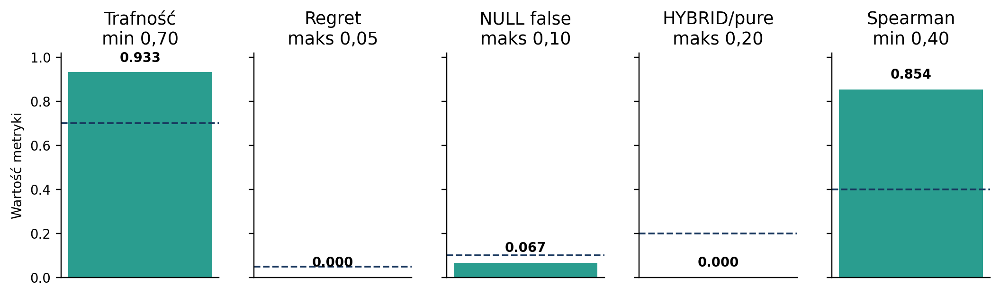
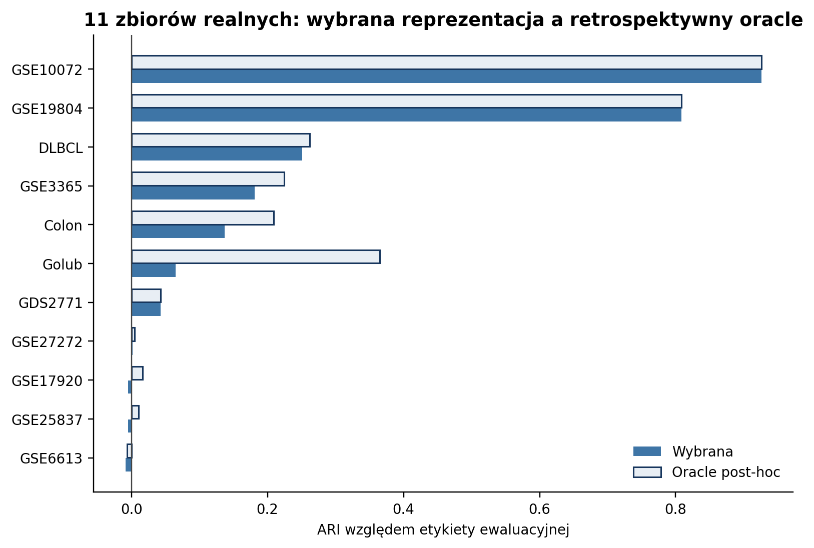
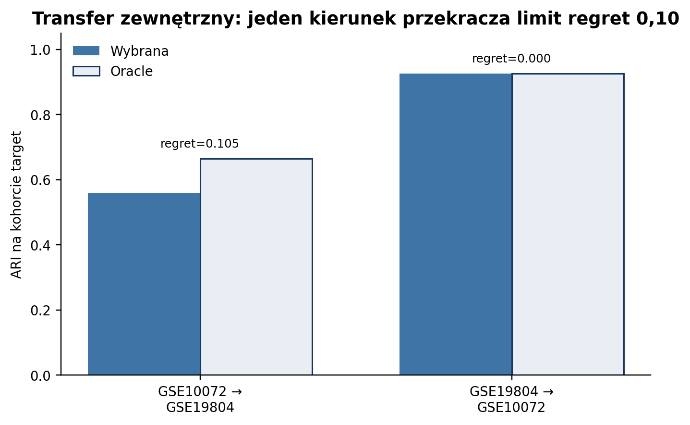
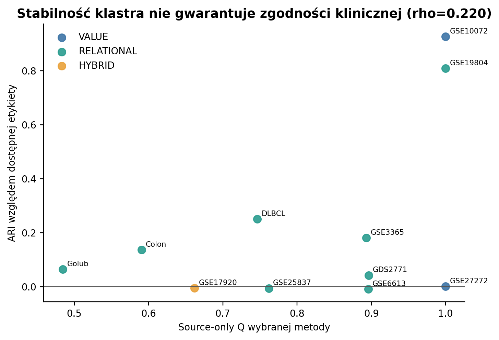
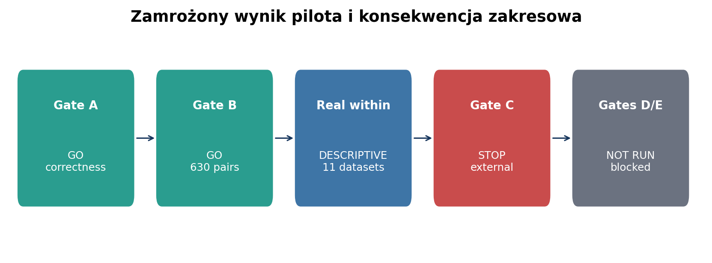

# Końcowy raport pilota SONATA BIS

Data zamknięcia: 2026-08-17

Protokół SHA-256: `5104901b66403ab29bbad24f7fdc48dda10121b1a584740ec47af02790d6a704`

## Wynik w jednym zdaniu

Mechanizm source-only trafnie rozróżnia rodziny reprezentacji w symulacjach (Gate B: GO), ale zewnętrzny transfer nie spełnił zamrożonego limitu w jednym kierunku (Gate C: STOP), dlatego regionów bezpośrednich i anchorów nie uruchomiono i nie należy przedstawiać ich jako zwalidowanych wyników pilota.

## Co tu właściwie robimy - prostym językiem

1. Zanim pogrupujemy pacjentów, sprawdzamy, jak ich porównywać: po wartościach, po kolejności/rangach cech albo po połączeniu obu widoków.
2. Każdy widok trafia do dokładnie tego samego deterministycznego PAM, więc porównujemy reprezentacje, a nie różne algorytmy grupowania.
3. PAM wybiera medoid - rzeczywistego, centralnego pacjenta grupy. To jest obecny odpowiednik centroidu.
4. Planowane regiony miały później opisać grupę krótkimi regułami typu `gen_A > gen_B`. Nie zostały wykonane, ponieważ poprzedzająca je bramka zewnętrzna zakończyła się STOP.
5. Etykiety diagnoz nie służą do uczenia ani wyboru reprezentacji. Są odczytywane dopiero po zamrożeniu wszystkich przypisań i służą tylko do końcowej oceny.

## Zamrożone decyzje

| Element | Wynik | Interpretacja |
|---|---:|---|
| Gate A | GO | poprawność, deterministyczność i bariery leakage potwierdzone |
| Gate B | GO | wszystkie kryteria pełnej siatki 630 par spełnione |
| 11 zbiorów realnych | opisowe | 11/11 zamrożone przed etykietami; to nie jest walidacja zewnętrzna |
| Gate C | STOP | regret 0,105284 przekroczył limit 0,10 o 0,005284 |
| PILOT-016--018 | NOT RUN | regiony i anchory zablokowane; brak retrospektywnego ratowania |
| PILOT-019--020 | COMPLETE | walidacja, tabele, 6 figur, raport i tekst do wniosku |

## Gate B - dowód kontrolowany

Pełna siatka obejmowała 630 par source-target. Trafność rodziny wyniosła 0,933, mediana regret 0,000, częstość fałszywej struktury NULL 0,067, wybór HYBRID w czystych reżimach 0,000, a korelacja Spearmana między różnicami Q i zachowaniem target 0,854. Każde kryterium przeszło bez zmiany progu.

## Jedenaście zbiorów realnych - kontrola opisowa

Audyt wybrał RELATIONAL dla 8 zbiorów, VALUE dla 2 i HYBRID dla 1. W 9/11 przypadków wybrany wariant był nie dalej niż 0,05 ARI od retrospektywnego oracle; mediana regret wyniosła 0,011. Jednocześnie mediana wybranego ARI wyniosła tylko 0,065. To znaczy: selektor zwykle wybierał wariant bliski najlepszemu z dostępnych, ale sama stabilna struktura często nie odpowiadała etykiecie klinicznej.

Pełne wartości znajdują się w `tables/real_within_results.csv`. Analiza jest wewnątrzzbiorowa i opisowa; nie zastępuje transferu zewnętrznego.

## Gate C - walidacja zewnętrzna

W kierunku GSE19804→GSE10072 wybrana reprezentacja osiągnęła ARI 0,926 i regret 0,000. W kierunku GSE10072→GSE19804 osiągnęła ARI 0,559 przy oracle 0,664, co daje regret 0,105284. Pokrycie i minimalne liczebności klastrów przeszły, lecz warunek regret nie przeszedł. Formalny wynik pozostaje STOP.

## Co wynik mówi o rankingu i grupowaniu

Reprezentacja rankingowa/relacyjna ma wyraźną domenę użyteczności: została poprawnie rozpoznana w kontrolowanych reżimach i wybrana w 8/11 realnych audytów. Nie jest jednak automatycznie biologicznie trafna. W kilku kohortach wszystkie warianty miały ARI bliskie zeru mimo stabilności source-only. Audyt odpowiada więc na pytanie «która geometria grupowania jest najbardziej adekwatna według danych source», a nie gwarantuje, że grupy odtworzą konkretną etykietę kliniczną.

## Regiony/reguły i centroid

Obecnie centrum klastra jest medoidem, czyli rzeczywistym pacjentem centralnym pod wybraną odległością. Post-hoc region miał zamienić relacyjny klaster w krótki profil reguł. Direct region miał jednocześnie wyznaczać reguły i przypisania. Anchor miał tylko ograniczać przestrzeń kandydatów. Żaden z tych trzech modułów nie został przetestowany, więc pilot nie dostarcza jeszcze dowodu na ich jakość interpretacyjną ani predykcyjną.

## Rekomendacja do wniosku SONATA BIS

Najbezpieczniejsza teza brzmi: różne reprezentacje mają odmienne domeny kompetencji, a source-only Representation Audit może tworzyć mapę adekwatności i jawnie wstrzymywać wnioskowanie. Nie należy twierdzić, że automatyczny wybór został już w pełni potwierdzony zewnętrznie ani że direct regions/anchory mają wyniki pilotażowe. Regiony można pozostawić jako główną hipotezę metodologiczną przyszłego projektu, z walidacją prospektywną i wyraźną bramką przed rozszerzeniem zakresu.

## Integralność i odtwarzalność

PILOT-019 zwalidował 630/630 zadań symulacyjnych, 210 audytów source, 2/2 transfery, 11/11 audytów realnych, 390 raportów NULL dla etapów realnych oraz brak zmian w plikach śledzonych obu repozytoriów referencyjnych. Jeden zastany, nieśledzony plik tymczasowy AIR został wykluczony z adapterów i pozostawiony bez zmian. Hash pełnego drzewa within-dataset: `47ce572d4db1ff6cf77fd60b8202e04c6eadcfc895a5a2a5c3454ea17e1801af`.

Odstępstwa od protokołu: nie zmieniono żadnego kryterium eksperymentalnego. PILOT-016--018 nie wykonano wskutek zamrożonego Gate C STOP; jest to kontrola zakresu, nie ciche odstępstwo.
